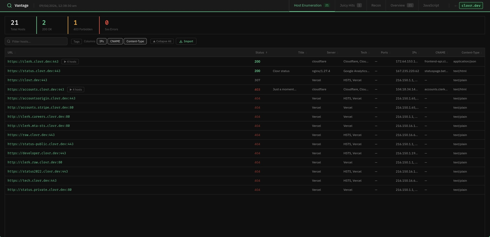
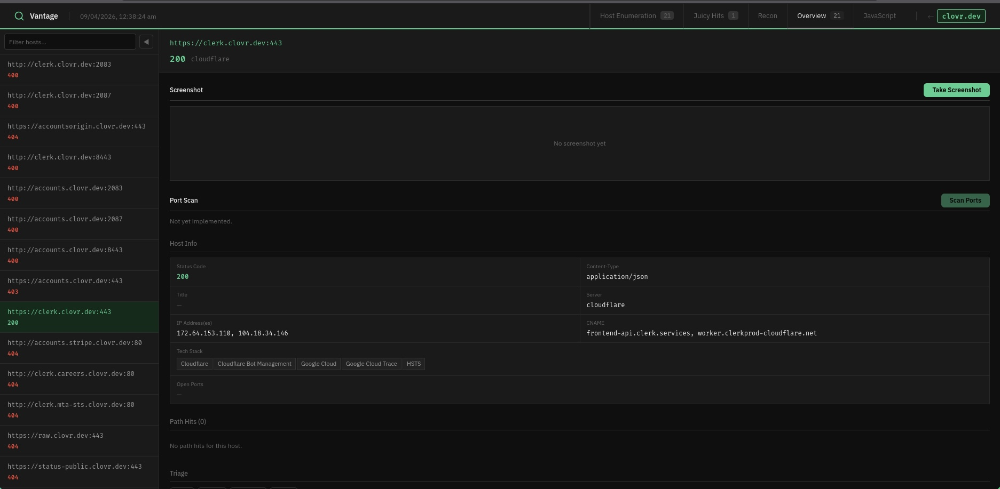
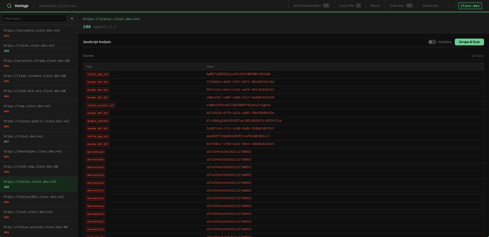
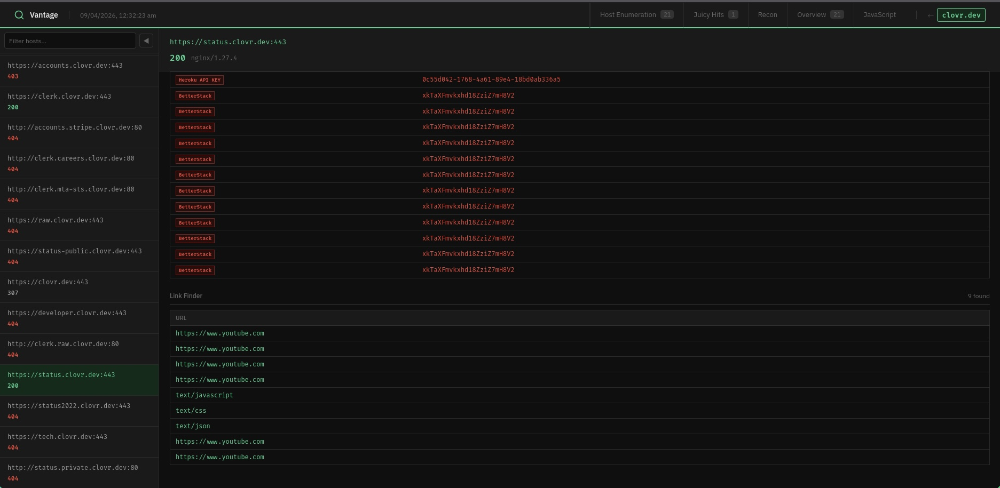

# recon

Vantage is a bug bounty / penetration testing reconnaissance automation toolkit with a Go-powered web dashboard.

> **All reconnaissance must only be run against domains with explicit written authorisation.**

---

## Overview

Five-stage automated pipeline: passive subdomain enumeration → active DNS resolution → port scanning + CDN detection → HTTP probing + sensitive path discovery → interactive dashboard.

Results are stored in per-target SQLite databases and surfaced through a dark-themed React dashboard with filtering, triage, AI-assisted prioritisation, and notes.


---

## Pipeline

```
Stage 1 — Passive Subdomain Enumeration
  subfinder + crt.sh + GitHub subdomains
  → subdomains/all_subs.txt

Stage 2 — Active DNS Resolution + Permutation
  puredns + alterx
  → subdomains/final_subs.txt

Stage 3 — Port Scanning + CDN Detection
  dnsx + grepcidr + masscan (ports 0–10000)
  → probe/port-scan/<domain>_domain_ips.json
  → probe/port-scan/<domain>_ports.json

Stage 4 — HTTP Probing + Sensitive Path Discovery
  httpx (status, title, tech, server, IP, CNAME, open ports)
  Probes 20 sensitive paths (.env, .git/config, actuator, swagger, ...)
  → probe/httpx/<domain>_httpx_enriched.json
  → probe/httpx/<domain>_path_hits.txt

Stage 5 — Dashboard
  Go + chi + React + SQLite — http://127.0.0.1:8080
```

---

## Usage

### Full pipeline

```bash
./recon.sh <domain>
```

### Individual stages

```bash
# Stage 1 — passive subdomain enumeration (-a = append mode)
./recon-files/subdomain2.sh [-a] <domain>

# Stage 2 — active DNS resolution (-b = skip bruteforce)
./recon-files/subdomains_active.sh [-b] <domain>

# Stage 3 — port scan + CDN detection
./recon-files/port_scan.sh <domain>

# Stage 4 — HTTP probing + path discovery
./recon-files/alive_httpx_probe.sh <domain>

# Stage 5 — dashboard
cd /path/to/recon && go run ./server2/cmd/main.go
# Open http://127.0.0.1:8080
```

### Optional: web crawling

```bash
./recon-files/crawl.sh <domain_file> [--headless]
```

---

## Screenshots

**Target selection**


**Dashboard**


**Overview**


**Js Analysis** 



---

# Install


---

## Dashboard

The dashboard (`server2/`) is a Go backend + React SPA running on `http://127.0.0.1:8080`.

### Setup

```bash
cd server2

# Install frontend dependencies and build
cd frontend && npm install && npm run build && cd ..

# Create .env with your Anthropic API key (for AI triage)
echo 'ANTHROPIC_API_KEY=sk-ant-...' > .env

# Run
go run ./cmd/main.go
```

### Target selection (`/`)

- Table of all targets with live host counts, 200 OK, 403, 5xx stats
- Create new target, delete target, select active target
- Filter across targets, summary totals bar

### Host Enumeration tab

- Virtualised table — handles hundreds of hosts without slowdown
- Hosts grouped by hostname with expand/collapse for alt ports
- Sort by any column, filter by text
- Column visibility toggles: IPs, CNAME, Content-Type
- **Tag filter dropdown** — filter by triage status (`to-test`, `dead-end`, `tested`) and badges (`api`, `interesting`) with multi-select
- **Hide/unhide** — hide irrelevant hostname groups from the table, state persists across page reloads
- Triage tags shown inline on rows
- Click row → side panel with full host detail, triage buttons, notes
- Import button — reads httpx probe output from disk and upserts into SQLite

### Juicy Hits tab

- All sensitive path hits for the target
- Severity badges: high (2xx), medium (5xx), low (other)
- Filter by URL, severity, or status code
- Sort by severity, click URL to open in new tab

### Overview tab

- Sidebar host list with filter
- Screenshot viewer — auto-loads existing screenshot, "Take Screenshot" captures on demand via gowitness
- Full host info grid: status, title, server, tech, ports, IPs, CNAME, content-type
- Related path hits for the selected host
- Triage buttons + notes with live save

### AI Triage

The dashboard integrates Claude Haiku via the Anthropic API for automated domain prioritisation.

`POST /api/{domain}/ai/domains` — reads all hosts for the target, sends them to Haiku in batches of 50, and classifies each into:

| Tier | Meaning |
|------|---------|
| Tier 1 | Test now — auth pages, admin panels, internal tooling, dev environments, known high-value tech |
| Tier 2 | Test later — generic apps, unclear attack surface, needs more investigation |
| Tier 3 | Don't bother — parked domains, CDN assets, 503s, pure marketing sites |

Results are stored per-host in the database and surfaced as filterable tags in the Host Enumeration tab.

---

## Dependencies

### Recon tools

```
subfinder
github-subdomains
puredns
alterx
dnsx
httpx
masscan       # requires sudo
gowitness     # for screenshots
katana        # optional, for crawling
gau           # optional
waybackurls   # optional
```

### Utilities

```
curl, jq, whois, grepcidr, wget
```

### Go (dashboard)

```
go 1.24+
github.com/go-chi/chi/v5
github.com/mattn/go-sqlite3
github.com/google/uuid
github.com/anthropics/anthropic-sdk-go
github.com/joho/godotenv
```

### Node (frontend build)

```
node 18+
npm
```

### External data

- [SecLists](https://github.com/danielmiessler/SecLists) at `/usr/share/seclists/`
- Resolver lists from [trickest/resolvers](https://github.com/trickest/resolvers)

---

## Directory Structure

```
recon/
├── recon.sh                          # Main orchestration script
├── recon-files/
│   ├── subdomain2.sh                 # Stage 1
│   ├── subdomains_active.sh          # Stage 2
│   ├── port_scan.sh                  # Stage 3
│   ├── alive_httpx_probe.sh          # Stage 4
│   └── crawl.sh                      # Optional crawling
├── subdomains/                       # DNS output
├── probe/
│   ├── httpx/                        # HTTP probe output
│   └── port-scan/                    # Port scan output
├── temp/                             # Cached CDN ranges
└── server2/                          # Go + React dashboard
    ├── cmd/main.go                   # Entry point
    ├── .env                          # API keys (gitignored)
    ├── databases/                    # Per-target SQLite files (gitignored)
    ├── internal/
    │   ├── database/                 # DB logic, types, import, AI read
    │   ├── server/                   # Chi router + HTTP handlers
    │   └── tools/                    # Screenshot job system, AI triage
    ├── frontend/                     # React + TypeScript (Vite)
    │   └── src/
    │       ├── pages/                # TargetsPage, DashboardPage, HostsTab, HitsTab, OverviewTab, HostPanel
    │       ├── lib/types.ts          # Shared TypeScript interfaces
    │       └── styles/globals.css   # Dark theme
    └── static/
        ├── dist/                     # Vite build output (served by Go)
        └── images/screenshots/       # Cached gowitness screenshots
```

---

## Security Notes

- Set `ANTHROPIC_API_KEY` in `server2/.env` — do not hardcode
- Set `GITHUB_TOKEN` as an environment variable — do not hardcode tokens in scripts
- The dashboard binds to `127.0.0.1:8080` only — do not expose externally
- `masscan` requires root/sudo
- Do not commit scan results, target data, or API tokens to version control
