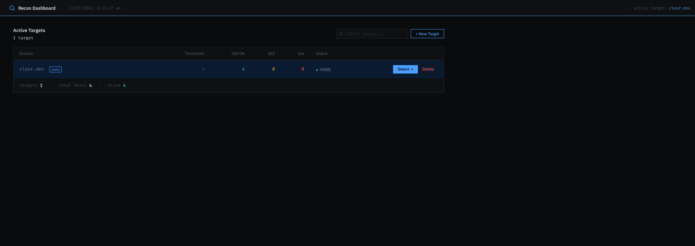
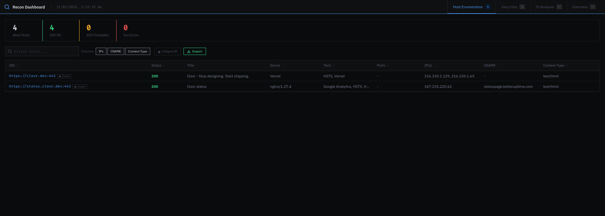
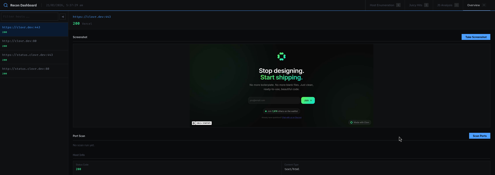
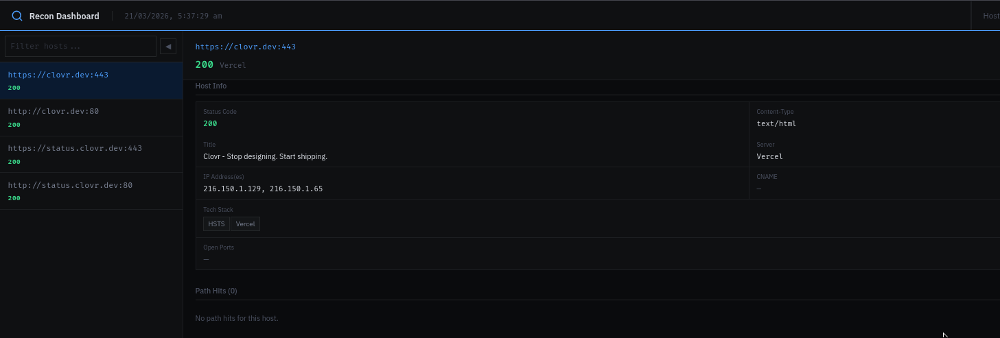

# recon

A bug bounty / penetration testing reconnaissance automation toolkit with a Go-powered web dashboard.

> **All reconnaissance must only be run against domains with explicit written authorisation.**

---

## Overview

Five-stage automated pipeline: passive subdomain enumeration → active DNS resolution → port scanning + CDN detection → HTTP probing + sensitive path discovery → interactive dashboard.

Results are stored in per-target SQLite databases and surfaced through a dark-themed dashboard with filtering, triage, and notes.


---

## Pipeline

```
Stage 1 — Passive Subdomain Enumeration
  subfinder + crt.sh + GitHub subdomains
  → subdomains/all_subs.txt

Stage 2 — Active DNS Resolution + Permutation
  puredns + alterx
  → subdomains/final_subs.txt

Stage 3 — Port Scanning + CDN Detection
  dnsx + grepcidr + masscan (ports 0–10000)
  → probe/port-scan/<domain>_domain_ips.json
  → probe/port-scan/<domain>_ports.json

Stage 4 — HTTP Probing + Sensitive Path Discovery
  httpx (status, title, tech, server, IP, CNAME, open ports)
  Probes 20 sensitive paths (.env, .git/config, actuator, swagger, ...)
  → probe/httpx/<domain>_httpx_enriched.json
  → probe/httpx/<domain>_path_hits.txt

Stage 5 — Dashboard
  Go + chi + SQLite — http://127.0.0.1:8080
```

---

## Usage

### Full pipeline

```bash
./recon.sh <domain>
```

### Individual stages

```bash
# Stage 1 — passive subdomain enumeration (-a = append mode)
./recon-files/subdomain2.sh [-a] <domain>

# Stage 2 — active DNS resolution (-b = skip bruteforce)
./recon-files/subdomains_active.sh [-b] <domain>

# Stage 3 — port scan + CDN detection
./recon-files/port_scan.sh <domain>

# Stage 4 — HTTP probing + path discovery
./recon-files/alive_httpx_probe.sh <domain>

# Stage 5 — dashboard
cd /path/to/recon && go run ./server2/cmd/main.go
# Open http://127.0.0.1:8080
```

### Optional: web crawling

```bash
./recon-files/crawl.sh <domain_file> [--headless]
```

---

## Screenshots

**Target selection**


**Dashboard**


**Overview**



---

## Dashboard

The Go dashboard (`server2/`) runs on `http://127.0.0.1:8080`.

**target.html** — select or create a target domain
**index.html** — three-tab dashboard for the selected target

| Tab | Description |
|-----|-------------|
| Host Enumeration | Sortable/filterable table of all live hosts with status, title, tech, ports, IPs, CNAME, badges |
| Juicy Hits | Sensitive path hits classified by severity (high / medium / low) |
| JS Analysis | Endpoints and secrets extracted from JS files |

Features:
- **Import** button — reads probe output from disk, upserts into SQLite on demand
- **Triage** — mark hosts as `to-test`, `dead-end`, or `tested`
- **Notes** — per-host notes saved to the database
- **Badges** — auto-tagged at import time (`interesting`, `api`)

---

## Dependencies

### Recon tools

```
subfinder
github-subdomains
puredns
alterx
dnsx
httpx
masscan       # requires sudo
katana        # optional, for crawling
gau           # optional
waybackurls   # optional
```

### Utilities

```
curl, jq, whois, grepcidr, wget
```

### Go (dashboard)

```
go 1.21+
github.com/go-chi/chi/v5
github.com/mattn/go-sqlite3
```

### External data

- [SecLists](https://github.com/danielmiessler/SecLists) at `/usr/share/seclists/`
- Resolver lists from [trickest/resolvers](https://github.com/trickest/resolvers)

---

## Directory Structure

```
recon/
├── recon.sh                          # Main orchestration script
├── recon-files/
│   ├── subdomain2.sh                 # Stage 1
│   ├── subdomains_active.sh          # Stage 2
│   ├── port_scan.sh                  # Stage 3
│   ├── alive_httpx_probe.sh          # Stage 4
│   └── crawl.sh                      # Optional crawling
├── subdomains/                       # DNS output
├── probe/
│   ├── httpx/                        # HTTP probe output
│   └── port-scan/                    # Port scan output
├── temp/                             # Cached CDN ranges
└── server2/                          # Go dashboard
    ├── cmd/main.go
    ├── databases/                    # Per-target SQLite files
    ├── internal/
    │   ├── database/                 # DB logic, types, import
    │   └── server/                   # HTTP handlers (chi)
    └── static/
        ├── target.html
        └── index.html
```

---

## Security Notes

- Set `GITHUB_TOKEN` as an environment variable — do not hardcode tokens in scripts
- The dashboard binds to `127.0.0.1:8080` only — do not expose externally
- `masscan` requires root/sudo
- Do not commit scan results, target data, or API tokens to version control
